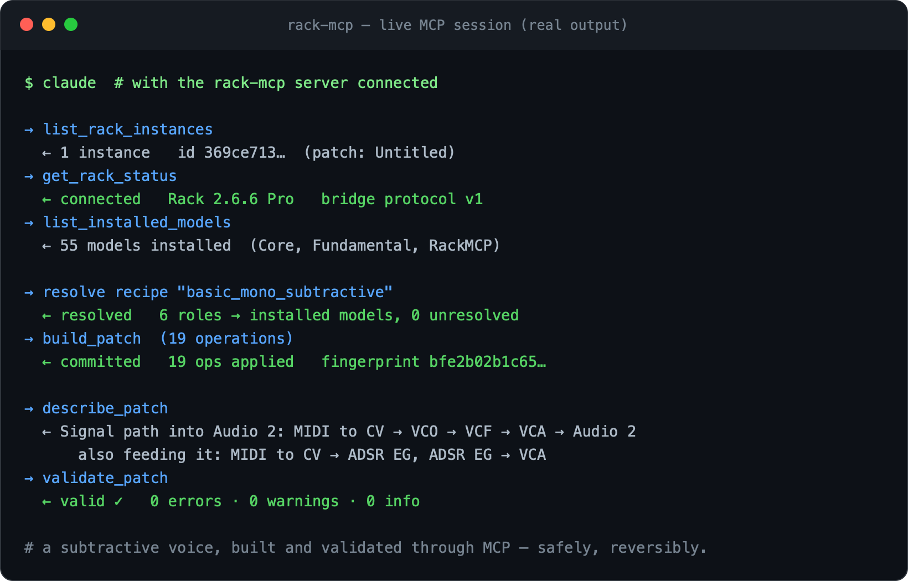
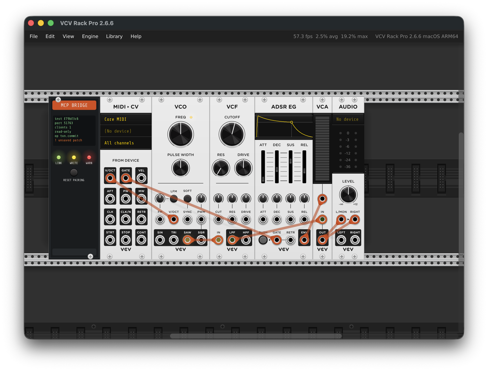

# Rack MCP

[](docs/security/licensing.md)
[](#use-it-from-claude-code)
[](https://github.com/ColonelKernel/vcv-rack-mcp/actions/workflows/ci.yml)

A production-quality, safety-first [Model Context Protocol](https://modelcontextprotocol.io)
integration for [VCV Rack](https://vcvrack.com) 2.6.6 (Free or Pro, standalone GUI mode).

Rack MCP lets an MCP client (Claude and other MCP hosts) discover running Rack
instances, inspect patches, explain and validate signal flow, preview and
atomically apply structured patch changes, manage patch files with checkpoints
and recovery, and read signal telemetry through a dedicated Probe module —
all locally, over an authenticated loopback bridge, with explicit confirmation
for destructive changes.

**Repository:** <https://github.com/ColonelKernel/vcv-rack-mcp>

```bash
git clone https://github.com/ColonelKernel/vcv-rack-mcp.git
```

## Demo

A live session — building and validating a subtractive-synth voice through the
MCP against a running Rack instance. This is **real tool output**, captured by
`pnpm --filter @rackmcp/integration run demo`:




<details>
<summary>Transcript (text)</summary>

```text
$ claude  # with the rack-mcp server connected

→ list_rack_instances
  ← 1 instance   id 4b1c944e…  (patch: Untitled)
→ get_rack_status
  ← connected   Rack 2.6.6 Pro   bridge protocol v1
→ list_installed_models
  ← 53 models installed  (Core, Fundamental, RackMCP)

→ resolve recipe "basic_mono_subtractive"
  ← resolved   6 roles → installed models, 0 unresolved
→ build_patch  (19 operations)
  ← committed   19 ops applied   fingerprint d197ec233a98…

→ describe_patch
  ← Signal path into Audio 2: VCO → VCF → MIDI to CV → ADSR EG → VCA → Audio 2
→ validate_patch
  ← valid ✓   0 errors · 0 warnings · 0 info
```

</details>

…and the patch those tool calls actually build, in the running Rack window —
MIDI→CV → VCO → VCF → VCA with an ADSR envelope → Audio, wired live over the
bridge. The **MCP Bridge** panel on the left shows the connection state
(`op txn.commit`, read-only, one client) that the session above produced:



## Components

| Path | What | License |
| --- | --- | --- |
| `apps/mcp-server` | Stdio MCP server (TypeScript, MCP SDK 1.30.0) | MIT |
| `plugins/RackMCP` | Rack 2 plugin: Bridge + Probe modules, loopback bridge service (C++11) | GPL-3.0-or-later |
| `packages/schemas` | Canonical Zod schemas → JSON Schema + C++ codegen | MIT |
| `packages/protocol` | Bridge framing + client (TypeScript side) | MIT |
| `packages/adapters` | 22 versioned module adapters (Core + Fundamental + RackMCP) | MIT |
| `packages/recipes` | 8 versioned high-level patch recipes | MIT |
| `packages/test-client` | Scriptable MCP test client | MIT |

The MCP surface is **29 tools**, **6 resources** (`rack://…`), and **5 prompts**.
See [the licensing note](docs/security/licensing.md) for why the plugin is
GPL-3.0-or-later while the server and packages are MIT.

## Documentation

**Architecture**
- [ADR-0001 — Execution model](docs/architecture/ADR-0001-execution-model.md)
- [ADR-0002 — Bridge lifecycle and threading](docs/architecture/ADR-0002-bridge-lifecycle-and-threading.md)
- [ADR-0003 — Canonical schema codegen](docs/architecture/ADR-0003-canonical-schema-codegen.md)
- [ADR-0004 — Adapter and recipe knowledge model](docs/architecture/ADR-0004-adapter-and-recipe-knowledge-model.md)
- [Threading and real-time-safety model](docs/architecture/threading-model.md)
- [Local bridge protocol](docs/architecture/bridge-protocol.md)
- [Definition-of-done audit](docs/architecture/definition-of-done-audit.md)
- [Normative specification](docs/spec/rack-mcp-spec.md)

**Security**
- [Threat model](docs/security/threat-model.md)
- [Pairing and multi-instance guide](docs/security/pairing-and-multi-instance.md)
- [VCV licensing note](docs/security/licensing.md)

**Tools and operation**
- [MCP tool reference](docs/tools/tool-reference.md) (generated)
- [Installation guide](docs/tools/installation.md)
- [Clean-machine install walkthrough](docs/tools/clean-machine-install.md)
- [Configuration examples for MCP hosts](docs/tools/configuration-examples.md)
- [Backup and recovery](docs/tools/backup-and-recovery.md)
- [Troubleshooting](docs/tools/troubleshooting.md)
- [Compatibility matrix](docs/tools/compatibility-matrix.md)
- [Release and rollback procedure](docs/tools/release-and-rollback.md)

**Extending**
- [Adapter authoring guide](docs/module-adapters/adapter-authoring.md)
- [Recipe authoring guide](docs/module-adapters/recipe-authoring.md)

## Status

All eleven delivery phases are complete: schemas and test infrastructure; plugin
lifecycle, manifest, authentication, and status; stdio server and discovery;
read-only snapshot and catalog; parameter mutation; module and cable
transactions; preview/confirm/rollback; patch files and recovery; Probe
telemetry; adapters, recipes, validation, prompts, and resources; and security
hardening, packaging, and documentation. See the
[definition-of-done audit](docs/architecture/definition-of-done-audit.md) for the
spec-by-spec evidence.

Verified live on **macOS arm64**; Windows x64, Linux x64, and macOS x64 build and
test in CI. See the [compatibility matrix](docs/tools/compatibility-matrix.md).

## Development

```bash
pnpm install
pnpm run build          # build all TS packages + the server
pnpm run test           # unit/contract tests across the workspace
pnpm run gen            # regenerate JSON Schema + C++ protocol artifacts
pnpm run check:gen      # fail if generated protocol artifacts are stale
pnpm run docs:tools     # regenerate docs/tools/tool-reference.md from the schema

# C++ core tests (framing, queues, crypto, JSON limits, telemetry, service)
cmake -S tests/cpp -B tests/cpp-build && cmake --build tests/cpp-build && ctest --test-dir tests/cpp-build

# Build and package the Rack plugin
./scripts/fetch-rack-sdk.sh                              # pinned Rack SDK 2.6.6
make -C plugins/RackMCP RACK_DIR=../../vendor/Rack-SDK
make -C plugins/RackMCP dist RACK_DIR=../../vendor/Rack-SDK   # -> dist/*.vcvplugin

# Bundle the server as a single reproducible file for a host to launch
pnpm --filter @rackmcp/mcp-server run bundle            # -> dist/bundle/rack-mcp-server.mjs
```

Live integration tests launch the installed VCV Rack 2 Pro 2.6.6 against an
isolated user directory:

```bash
pnpm --filter @rackmcp/integration run write     # transaction lifecycle
pnpm --filter @rackmcp/integration run recipes   # adapters, recipes, resources
pnpm --filter @rackmcp/integration run probe     # telemetry plumbing
pnpm --filter @rackmcp/integration run quit      # graceful quit runs destroy() cleanly
```

New here? Start with the
[clean-machine install walkthrough](docs/tools/clean-machine-install.md).

## Use it from Claude Code

This repo ships a project-scoped [`.mcp.json`](.mcp.json) that wires up the
`rack-mcp` server for Claude Code. After building the server, open the repo in
Claude Code and approve the server when prompted:

```bash
pnpm install && pnpm -r build          # produces apps/mcp-server/dist/index.js
```

The server points at your real Rack user directory, so start VCV Rack 2.6.6 with
the RackMCP plugin (add a Bridge module) before using the tools. For other hosts
(Claude Desktop, etc.), or to run the self-contained bundle, see the
[configuration examples](docs/tools/configuration-examples.md) and the
[installation guide](docs/tools/installation.md).

## Unsupported environments

Stated plainly: Rack Pro inside a DAW, headless Rack, and Rack versions other
than 2.6.6 are not supported. Arbitrary signal monitoring is available only
through the Probe module, and opaque third-party module state is never mutated
without a matching adapter. See the
[compatibility matrix](docs/tools/compatibility-matrix.md).
