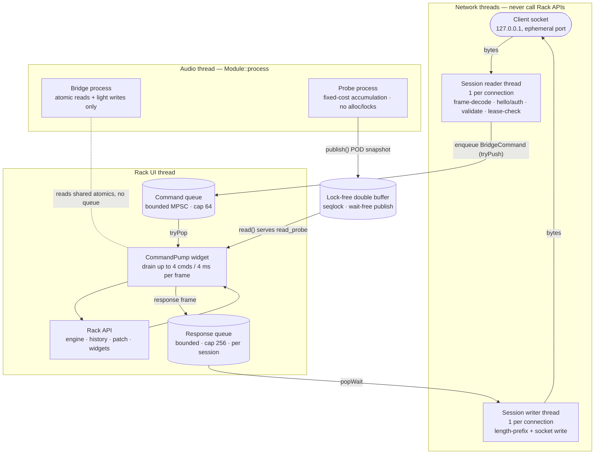

# Threading and real-time-safety model

Rack MCP runs inside a live VCV Rack 2.6.6 process, so its plugin shares an
address space with Rack's audio engine and its OpenGL/NanoVG UI. The single hard
constraint that shapes every other decision here is simple: **the audio thread
must never stall.** A blocked `Module::process()` produces audible dropouts and
can invert priorities against the whole engine. Everything below exists to keep
network I/O, JSON, and Rack API mutation *off* the audio thread while still
letting an MCP client drive the running patch.

This document explains which thread does what, the queues that connect them, the
per-frame command-pump budget, why the audio thread is forbidden from a specific
list of operations, and why patch load/clear is owned by the pump rather than a
module widget. It is the operational companion to
[ADR-0001](./ADR-0001-execution-model.md) and section 4 of the
[normative spec](../spec/rack-mcp-spec.md).

## The four thread classes

| Thread | Count | Owns | Touches Rack APIs? |
| --- | --- | --- | --- |
| Accept thread | 1 | The loopback listener; spawns per-session reader/writer threads; reaps defunct sessions | No |
| Session reader | 1 per connection (max 8, of which at most 4 unauthenticated) | Byte reads, frame decode, `hello`/`auth`, JSON-limit and lease checks, handshake deadline, command enqueue | No |
| Session writer | 1 per connection | Draining the per-session response queue, length-prefix framing, socket writes | No |
| Heartbeat thread | 1 | Writing the discovery manifest (~2 s) from the cached UI state | No |
| **CommandPump (Rack UI thread)** | 1 | **All Rack API work**: engine, history, patch, module/cable widgets, telemetry reads | **Yes — exclusively** |
| **Audio thread** (`Module::process`) | Rack-owned | Bridge atomic-flag reads + light writes; Probe fixed-cost accumulation | No — DSP-safe primitives only |

Two of these carry the real-time-safety weight and deserve their own sections:
the **command pump** on the UI thread, and the **audio thread**. The network
threads are deliberately dumb — they move bytes and never reach into Rack.

## Data flow



The diagram uses **shape, not colour**, to carry meaning so it stays legible in
light and dark themes: cylinders are bounded queues/buffers, rectangles are
running code, the stadium node is the socket, and the dashed edge is a
lock-free atomic read rather than a queued handoff.

Follow one request end to end:

1. A client writes a length-prefixed JSON frame to the loopback socket.
2. The **session reader thread** decodes the frame (`FrameDecoder`, 1 MiB cap),
   enforces JSON depth/size/node limits, runs the `hello` → `welcome` → `auth`
   handshake, and for a request re-checks the writer lease when the method is
   mutating. Pure service-state methods (`lease.acquire`/`renew`/`release`) are
   answered **inline on this thread** because they touch no Rack APIs.
3. Anything that needs Rack is packaged as a `BridgeCommand` and pushed onto the
   shared **command queue** (`BoundedQueue<BridgeCommand>`, capacity 64). A push
   onto a full queue fails fast and the client gets a retryable
   `BRIDGE_NOT_READY`.
4. The **CommandPump**, stepping on Rack's UI thread, pops commands within its
   per-frame budget, re-validates each mutating command's writer lease, executes
   them against the Rack API, and pushes the response frame onto that
   connection's **response queue** (`BoundedQueue<std::string>`, capacity 256).
   An overflow here is counted as a dropped response.
5. The **session writer thread** pops the frame (`popWait`), length-prefix
   encodes it, and writes it back to the socket.

The two queues are the *only* crossings between network threads and the Rack UI
thread. Both are bounded, so a slow or hostile client applies backpressure
instead of growing memory without limit.

## The command pump

All Rack API work funnels through one persistent widget, `CommandPumpWidget`,
attached to `APP->scene`. Its `step()` runs on Rack's UI thread every frame and
drains the command queue:

```cpp
while (drained < gen::LIMIT_PUMP_COMMANDS_PER_FRAME &&
       steadyNowMs() - start <= gen::LIMIT_PUMP_FRAME_BUDGET_MS &&
       bridge.commandQueue().tryPop(cmd)) {
    // executeCommand(cmd) does the actual Rack API work
}
```

### Per-frame budget

The loop stops at whichever limit is hit first:

- `LIMIT_PUMP_COMMANDS_PER_FRAME` = **4 commands**, and
- `LIMIT_PUMP_FRAME_BUDGET_MS` = **4 ms** of wall time.

This caps how long the pump can hold the UI thread in any single frame, so MCP
traffic degrades UI responsiveness gracefully instead of freezing the window
under a burst. Work that does not fit in one frame simply waits for the next
`step()`; the queue is the buffer. The pump records `pumpLastDrainMs` and
`pumpMaxDrainMs` (surfaced as `uiPumpLastDrainMs` / `uiPumpMaxDrainMs` in
`get_rack_status`), and the queue's own depth is reported as `commandQueueDepth`
/ `commandQueueMaxDepth`.

Three more pump responsibilities:

- **Deadline enforcement.** Each command carries a `deadlineAtMs`. If the
  deadline has already passed when the pump reaches it, the pump returns
  `TIMEOUT` without executing — a queued command that waited too long never
  mutates the patch.
- **Writer-lease re-validation.** The reader thread checked the lease at enqueue
  time, but the command has been sitting in a queue since; the holder may have
  released it, let it expire, or lost it to another connection. The pump calls
  `BridgeServer::commandLeaseStillValid(cmd)`, which compares the live holder's
  connection **and** `leaseId` against the ones recorded on the command, and
  answers `WRITER_LEASE_REQUIRED` (`retrySafe: true`) rather than mutating on a
  lease the caller no longer holds. Non-mutating commands always pass. A client
  can therefore see `WRITER_LEASE_REQUIRED` for a request that passed the gate
  when it was submitted.
- **UI-state cache and external-replacement poll.** About twice a second the
  pump refreshes a small `UiStateCache` (patch name, saved/unsaved, Bridge
  presence). This is how the heartbeat and `welcome` frames report Rack facts
  *without* the network threads ever calling a Rack API. On the same cadence
  `pollPatchReplacement()` compares the patch path, undo-history depth, and
  module-id set against a watermark to notice a patch replaced through Rack's
  own UI (File > New / Open / Revert, drag-drop), bumping `patchEpoch` and
  broadcasting `patch_epoch_changed` when it does. That state is file-static and
  unlocked, so it is correct *only* because the pump is its sole caller —
  calling it from any other thread would be a data race.

### Why the pump lives on the scene

The pump is attached to `APP->scene`, **not** `scene->rack`, and is created
lazily from the first Bridge `ModuleWidget::step()` via
`CommandPumpWidget::ensureAttached()`. The scene outlives individual patches,
whereas the rack widget's children are torn down and rebuilt on patch load and
clear. Anchoring the pump to the scene means it survives load/clear/restore and
keeps draining commands across a patch swap.

Audio-rate control is explicitly **not** a job for this path. The command queue
is for discrete, transactional edits; continuous modulation belongs to cables
and modules, never to a per-frame drained queue.

## Patch load and clear are owned by the pump

Patch load, clear, and restore replace the entire rack widget tree — including
the very Bridge `ModuleWidget` whose `step()` would otherwise be running. If a
module widget triggered a load from inside its own step, it would destroy the
object mid-call. That is forbidden by the spec, and the design forecloses it:
**load/clear/restore run only inside the persistent, scene-attached pump**,
which is never itself destroyed by a patch swap. `preview_load_patch` /
`commit_load_patch`, `preview_clear_patch` / `commit_clear_patch`, and
`restore_checkpoint` all execute here, and each bumps `patchEpoch` so stale
scoped references from the previous epoch are rejected with
`STALE_PATCH_EPOCH`. See the [tool reference](../tools/tool-reference.md) for
these tools.

## The audio thread

Rack calls `Module::process()` from its real-time audio callback, once per
sample. Both plugin modules keep that call fixed-cost and non-blocking.

### Forbidden operations

Inside `Module::process()` there is **no** networking, JSON parsing, logging,
filesystem access, mutex locking, heap allocation, or patch serialization.
Every one of those is either unbounded in time or can block on a lock the UI or
network threads hold. On the audio thread any of them risks an xrun (a missed
audio buffer) and, in the locking case, priority inversion against the whole
engine. The rule is absolute, not best-effort: the audio thread only reads and
writes lock-free primitives it owns or shares by atomics.

### Bridge `process()` — atomic reads only

The Bridge module's `process()` reads shared `std::atomic` flags — bridge
running state, active-session count, lease-held hint, unsaved-patch hint — and
writes panel light brightness on a clock divider. On the reset-button edge it
sets a single `std::atomic<bool> resetRequested`; the *widget* consumes that
flag later on the UI thread and does the actual secret rotation. No queue, no
lock, no allocation ever crosses this boundary — just atomic loads and stores.

### Probe `process()` — fixed-cost accumulation

The Probe module accumulates statistics over a measurement window of
`LIMIT_PROBE_WINDOW_MS` ≈ **50 ms** (clamped to at least 64 frames). For each of
its **8 probe inputs** and up to **16 polyphony channels**, each sample updates a
`ChannelAccumulator` — min, max, absolute peak, running sum and sum-of-squares
(for mean and RMS), clip count, non-finite count, and Schmitt-triggered
rising-edge count. Every branch is bounded, non-finite input is handled without
faulting, and nothing allocates:

```cpp
inline void accumulate(float v, bool first) {
    if (!std::isfinite(v)) { nonFinite++; return; }
    // min/max/peak/sum/sumSquares/clip/edge updates — all O(1), no alloc
}
```

`first` means **this channel's first finite sample**, not the window's first
frame. `ProbeModule::process()` tracks it in a 16-bit-per-input `channelSeen_`
mask (one shift, one mask test, one predictable branch per sample — still
allocation-free and fixed-cost), and sets the bit only once a finite sample has
landed, because `accumulate` returns early on non-finite input before touching
min/max. A channel whose cable is patched part-way into a window, or a poly
channel that appears mid-window, therefore seeds min/max from its own first real
sample instead of the 0 V reset seed. **Client-visible consequence:** such a
window now reports a min/max range covering only the samples that actually
arrived, so a caller that relied on 0 V always sitting inside the reported range
will see narrower ranges. Mean and RMS still divide by the whole-window frame
count, so they remain diluted for a channel that was present for only part of
the window.

When the window fills, the module finalizes a trivially-copyable
`ProbeWindowSnapshot` POD per input and **publishes** it. Reporting is capped at
≤ 20 Hz, so the accumulate-then-publish cycle never overruns the read side.

### The lock-free double buffer (seqlock)

Snapshots cross from the audio thread to readers through
`TelemetrySnapshotBuffer<T>`, a single-writer / multi-reader seqlock double
buffer. The DSP side's `publish()` is **wait-free and allocation-free**: it bumps
a sequence counter to odd (write in progress), writes the inactive slot behind
memory fences, then bumps the counter to even (stable). A reader loads the
sequence, copies the slot, and re-checks the sequence; if it changed, the read
retries. No lock is taken on either side, so the audio thread can never be
blocked by a reader.

Reads happen on the **pump**: when a client calls `read_probe`, the pump runs
`buildProbeReading`, which calls `read()` on the relevant input's buffer and
serializes the result to JSON on the UI thread — never on the audio thread. If
no window has been published yet (module just added), the reader reports an empty
reading rather than blocking. Telemetry that cannot be delivered is counted as
`droppedTelemetryFrames` rather than backing up into the audio thread.

## Why this arrangement holds up

- **The audio thread is wait-free.** It only ever touches atomics and the
  seqlock's fenced stores, so no network stall, disk I/O, or UI lock can ever
  reach into `Module::process()`.
- **The UI thread is bounded.** The pump drains at most 4 commands or 4 ms per
  frame, so a flood of MCP requests slows down gracefully instead of freezing
  Rack.
- **The network threads are Rack-blind.** They validate and frame bytes and
  nothing else; the single-writer lease is checked *before* a command is
  enqueued, so unauthorized mutations never reach the pump, and it is checked
  *again* on the pump immediately before execution, so a lease that lapsed or
  moved while the command was queued cannot be spent.
- **Backpressure is explicit.** Both crossings are bounded queues (64 commands,
  256 responses per session); overflow becomes a retryable error or a counted
  drop, never unbounded memory growth.
- **Shutdown is deterministic.** On plugin destruction the service stops
  accepting, closes each session's outbound queue *first* — that is what makes a
  writer drain and exit — waits for the writers against one shared ~1 s
  deadline, and only then closes the sockets and joins every reader and writer
  thread. Closing the stream first would have discarded the `shutting_down`
  event and any queued responses; the shared deadline keeps the pause bounded
  regardless of how many sessions are open. See the lifecycle in
  [ADR-0002](./ADR-0002-bridge-lifecycle-and-threading.md).

For the exact API surface the pump is allowed to call, see the Rack API
boundaries table in [ADR-0001](./ADR-0001-execution-model.md); for the tools
that ride this path, see the [tool reference](../tools/tool-reference.md).
